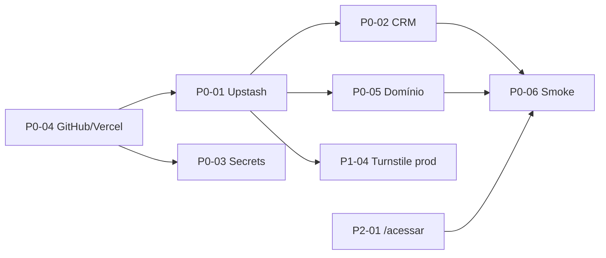

# Relatório de Auditoria Técnica Completa — PaivaTech Solutions

| Campo | Valor |
|-------|-------|
| **Versão do relatório** | 3.0 |
| **Data da auditoria** | 22/05/2026 |
| **Última atualização** | 22/05/2026 (reauditoria 360°, API settings/Portal Central, preflight OK, 62 testes) |
| **Escopo** | `c:\Projetos\PaivatechSolutions` (workspace completo) |
| **Aplicação em produção** | `apps/nexshape-site` |
| **Ferramenta de especificação** | `Fabrica/` |
| **Template de referência** | `docto/Auditoria_Completa.txt` |
| **Auditor** | Cursor Agent (auditoria automatizada + revisão de código) |
| **Testes na auditoria** | 16 arquivos Vitest **62 casos** + Playwright E2E — todos passando; preflight go-live OK |

> **Documento vivo:** atualize este arquivo quando um item do plano for concluído, um risco for mitigado ou o escopo mudar. Registrar em [Histórico de atualizações](#histórico-de-atualizações).

---

## Histórico de atualizações

| Data | Versão | Alteração |
|------|--------|-----------|
| 20/05/2026 | 1.0–1.5 | Auditoria inicial, mitigações P0/P1, landings, CI, Turnstile (ver commits anteriores) |
| 21/05/2026 | **2.0** | Reauditoria 360°: **painel admin**, `middleware.ts`, persistência `lib/db` (JSON + Upstash), APIs admin, WhatsApp configurável, redirects `/acessar`, 39 testes; notas e plano de ação recalculados |
| 21/05/2026 | **2.1** | Implementação plano: 7 rotas `/acessar`, `db.json` gitignore, Turnstile alinhado, `SESSION_SECRET` obrigatório prod, timing-safe, rate limit admin API, middleware explícito, 51 testes |
| 21/05/2026 | **2.2** | Fase 3: CSRF admin, CRM allowlist, Playwright E2E, CSP prod, 62 testes Vitest |
| 21/05/2026 | **2.2** | **GO_LIVE_FASE0.md** + `scripts/smoke-prod.ps1` — runbook operacional Fase 0 |
| 22/05/2026 | **3.0** | Reauditoria 360°: consolidação CSRF/allowlist/7×`/acessar`, API `/admin/api/settings` (Portal Central), preflight OK, notas recalculadas |

---

## Índice

1. [Visão Geral do Sistema](#1-visão-geral-do-sistema)
2. [Inventário de Funcionalidades](#2-inventário-de-funcionalidades)
3. [Auditoria de Rotas](#3-auditoria-de-rotas)
4. [Auditoria de Banco de Dados](#4-auditoria-de-banco-de-dados)
5. [Auditoria de Segurança](#5-auditoria-de-segurança)
6. [Auditoria de Permissões](#6-auditoria-de-permissões)
7. [Auditoria de APIs](#7-auditoria-de-apis)
8. [Integrações Externas](#8-integrações-externas)
9. [Processamento de Pagamentos](#9-processamento-de-pagamentos)
10. [Auditoria de Performance](#10-auditoria-de-performance)
11. [Auditoria de Código](#11-auditoria-de-código)
12. [Auditoria de Testes](#12-auditoria-de-testes)
13. [Auditoria de Frontend](#13-auditoria-de-frontend)
14. [Auditoria de Deploy](#14-auditoria-de-deploy)
15. [O que Enviar para Produção](#15-o-que-enviar-para-produção)
16. [Checklist de Configuração do Servidor](#16-checklist-de-configuração-do-servidor)
17. [Passo a Passo de Deploy](#17-passo-a-passo-de-deploy)
18. [Variáveis de Ambiente](#18-variáveis-de-ambiente)
19. [Backup e Recuperação](#19-backup-e-recuperação)
20. [Monitoramento e Logs](#20-monitoramento-e-logs)
21. [Conformidade e LGPD](#21-conformidade-e-lgpd)
22. [Documentação](#22-documentação)
23. [Riscos Críticos](#23-riscos-críticos)
24. [Melhorias Recomendadas](#24-melhorias-recomendadas)
25. [Nota Geral do Sistema](#25-nota-geral-do-sistema)
26. [Checklist Go-Live](#26-checklist-go-live)
27. [Plano de Ação Prioritizado](#27-plano-de-ação-prioritizado)
28. [Próximos passos (go-live)](#28-próximos-passos-go-live)

---

## 1. Visão Geral do Sistema

| Item | Detalhe |
|------|---------|
| **Nome** | PaivaTech Solutions — site institucional / marketing do **ecossistema PaivaTech** |
| **Objetivo de negócio** | Apresentar 7 produtos, capturar **leads**, configurar links de acesso aos apps e direcionar para CRM |
| **Público-alvo** | Empresas B2B (academias, clínicas, varejo, fintechs, operações comerciais) |
| **Tecnologias** | Next.js **15.5.18**, React 19, TypeScript 5, Tailwind 3.4, Zod 4, React Hook Form |
| **Runtime** | Node.js 22 (CI GitHub Actions); compatível com 20+ local |
| **Hospedagem prevista** | Vercel (`vercel.json`, região `gru1`) |
| **Persistência** | JSON local (`db.json`) + **Upstash Redis** (produção recomendada) |
| **Autenticação** | Painel admin: cookie HMAC `paivatech_admin_session` (24h) |
| **Pagamentos** | **Ausente** no código (apenas copy de marketing) |
| **Git** | Repositório ativo no monorepo; push remoto pode estar pendente |

### Estrutura do workspace

```
PaivatechSolutions/
├── apps/nexshape-site/     ← Aplicação web (único app deployável)
├── Fabrica/                ← Meta-framework de specs + validação JSON Schema
├── docto/                  ← Documentação, deploy, este relatório
└── .github/workflows/      ← CI nexshape-site
```

### Dependências principais (`nexshape-site`)

| Pacote | Uso |
|--------|-----|
| `next@15.5.18` | App Router, API routes, SSR |
| `zod`, `react-hook-form` | Validação formulário/API |
| `@upstash/ratelimit`, `@upstash/redis` | Rate limit + storage distribuído |
| `@marsidev/react-turnstile` | CAPTCHA opcional |
| `vitest` | Testes unitários (62 casos) + Playwright E2E |

### Serviços externos

| Serviço | Status | Uso |
|---------|--------|-----|
| Upstash Redis | Opcional (**crítico em prod**) | Leads, produtos, settings, rate limit |
| Cloudflare Turnstile | Opcional | Anti-bot em `/api/contact` |
| CRM Webhook | Configurável | `LEAD_DISPATCH_MODE=webhook` |
| WhatsApp | Links `wa.me` | Configurável no admin `/admin/contato` |
| Google Fonts | Ativo | `next/font/google` |
| Vercel | Target deploy | Hosting + SSL |
| PostgreSQL / Stripe / e-mail server | **Não implementados** | Spec `Fabrica/` apenas |

### Produtos SaaS (fora deste repositório)

Fitness, OralByte, Zyncora, ConsultaTech, KanbaPaiva, Commerce e PaivaGrowth existem como **landings + links configuráveis**; o código operacional dos apps **não está neste workspace**.

---

## 2. Inventário de Funcionalidades

### Módulo: Site institucional

| Funcionalidade | Rotas | Arquivos | Persistência | Status | Riscos |
|----------------|-------|----------|--------------|--------|--------|
| Home | `/` | `app/page.tsx` | — | Completo | — |
| Sobre | `/sobre` | `app/sobre/page.tsx` | — | Completo | — |
| Contato | `/contato` | `ContactForm.tsx` | Lead via API | Completo | Spam sem Turnstile+Redis |
| Sucesso | `/contato/enviado` | `app/contato/enviado/page.tsx` | — | Completo | — |
| Privacidade / Termos | `/privacidade`, `/termos` | + `lib/legal.ts` | — | Completo | Revisão jurídica |
| 7 landings | `/nexshape-fitness` … `/paivagrowth` | `app/*/page.tsx` | Textos via DB merge | Completo | Copy financeira |
| Produto legado | `/produtos/[slug]` | `app/produtos/[slug]/page.tsx` | DB | Completo | 301 → landing |
| SEO | `/sitemap.xml`, `/robots.txt` | `sitemap.ts`, `robots.ts` | — | Completo | URLs legado no sitemap |
| Acesso ao sistema | `/{landing}/acessar` (×7) | `app/*/acessar/route.ts` | Admin hosts | ✅ Completo | Host mal configurado → redirect errado |

### Módulo: API pública

| Funcionalidade | Rota | Arquivos | Status | Riscos |
|----------------|------|----------|--------|--------|
| Captura de lead | `POST /api/contact` | `route.ts`, `dispatch.ts`, `saveLead` | Completo | Rate limit fraco sem Upstash |
| Health | `GET /api/health` | `route.ts` | Completo | Expõe modo storage |

### Módulo: Painel admin

| Funcionalidade | UI | API | Status | Riscos |
|----------------|-----|-----|--------|--------|
| Login / logout | `/admin/login` | `POST login`, `POST logout` | Completo | Senha única; sem MFA |
| Leads (CRM interno) | `/admin` | `GET/PUT/DELETE /admin/api/leads` | Completo | PII; sem audit log |
| Produtos (textos + URLs) | `/admin/produtos` | `GET/PUT /admin/api/products` | Completo | Sessão vazada = alto impacto |
| WhatsApp site | `/admin/contato` | `GET/PUT /admin/api/contact` | Completo | — |
| Portal Central | `/admin/produtos` (sidebar) | `GET/PUT /admin/api/settings` | Completo | Validação URL mais fraca que contact API |
| Export CSV | Dashboard | — | Completo | Download PII |

### Módulo: Fabrica

Meta-tooling (Builder/Audit/Evolution), validação AJV — **não deployável** como produto.

### Não presentes neste repositório

Auth de usuários finais, RBAC, multi-tenant, vendas, estoque, financeiro, gateways de pagamento, ERP, SMS, APIs fiscais, filas de retry persistentes.

---

## 3. Auditoria de Rotas

### Páginas públicas (GET)

| URL | Handler | Middleware | Auth |
|-----|---------|------------|------|
| `/`, `/sobre`, `/contato`, `/contato/enviado`, `/privacidade`, `/termos` | `app/**/page.tsx` | `x-pathname` | Não |
| 7 landings + `/produtos/[slug]` | landings / `[slug]` | Idem | Não |
| `/sitemap.xml`, `/robots.txt` | metadata routes | Idem | Não |

### Admin (GET)

| URL | Auth | Observação |
|-----|------|------------|
| `/admin/login` | Não | Bypass middleware |
| `/admin`, `/admin/produtos`, `/admin/contato` | Cookie session | Redirect se inválido |

### APIs e route handlers

| URL | Método | Auth | Middleware | Risco |
|-----|--------|------|------------|-------|
| `/api/contact` | POST | Não | **Excluído** do matcher | Médio |
| `/api/health` | GET | Não | Excluído | Baixo |
| `/admin/api/login` | POST | Não | Bypass | Rate limit 5/min |
| `/admin/api/logout` | POST | Sim | Protegido | Baixo |
| `/admin/api/leads` | GET/PUT/DELETE | Sim | 401 JSON | Alto se sessão roubada |
| `/admin/api/products` | GET/PUT | Sim | Idem | Médio |
| `/admin/api/contact` | GET/PUT | Sim | CSRF + 60/min | Baixo |
| `/admin/api/settings` | GET/PUT | Sim | CSRF + 60/min | Médio (validação fraca) |
| `/{landing}/acessar` (×7) | GET | Não | Redirect 302 allowlist | Baixo |

### Achados

| Tipo | Achado | Severidade |
|------|--------|------------|
| Admin protegido | ✅ Middleware + cookie HMAC + CSRF | — |
| Duplicadas | `/produtos/{slug}` vs landing (301 intencional) | Info |
| Debug expostas | Nenhuma | — |
| Rotas `/acessar` | ✅ 7/7 implementadas | Resolvido |
| APIs duplicadas | `/admin/api/contact` vs `/admin/api/settings` (WhatsApp em ambos) | Média |
| Bypass antigo | ✅ Removido (`ADMIN_PUBLIC_PATHS` explícito) | Resolvido |

---

## 4. Auditoria de Banco de Dados

### Implementação (sem PostgreSQL)

| Camada | Detalhe |
|--------|---------|
| Modelo | Documento: `leads[]`, `products[]`, `siteSettings?` |
| Local | `apps/nexshape-site/db.json` |
| Vercel sem Redis | `/tmp/nexshape-site-db.json` (**efêmero**) |
| Produção | Redis: `admin:leads`, `admin:products`, `admin:site-settings` |

### Entidades lógicas

| Entidade | Campos críticos |
|----------|-----------------|
| `Lead` | PII, `status` (novo/atendimento/convertido/perdido), consent |
| `ProductCustomization` | 7 slugs fixos, textos, `appHost*`, `appAccessMode` |
| `SiteSettings` | `whatsappPhone`, `whatsappDisplay` |

### Verificações

| Item | Status |
|------|--------|
| Migrations SQL | Ausentes |
| FK / índices | N/A |
| Soft delete | DELETE físico em leads |
| Auditoria de alterações | Ausente |
| Multi-tenant | Não |
| **`db.json` no `.gitignore`** | ✅ Sim — preflight confirma não rastreado |
| Spec Fabrica Postgres | Planejado, não migrado |

---

## 5. Auditoria de Segurança

| Controle | Status | Evidência |
|----------|--------|-----------|
| Auth admin | Implementada | `lib/admin/auth.ts`, cookie httpOnly |
| RBAC | Ausente | Senha única `ADMIN_PASSWORD` |
| CSRF admin | ✅ Implementado | Double-submit cookie + header `x-admin-csrf` |
| XSS | Parcial | React + CSP; prod sem `unsafe-eval`; `unsafe-inline` em styles |
| SQL Injection | N/A | Sem SQL |
| Rate limiting | Implementado | Contato 10/min; login 5/min; fallback memória |
| Headers | Implementados | HSTS, CSP, X-Frame em `next.config.ts` |
| Turnstile | Opcional | Gap: UI usa só site key; API exige par completo |
| Honeypot | OK | Campo `website` |
| SSRF webhook | ✅ Mitigado | HTTPS + `CRM_WEBHOOK_ALLOWED_HOSTS` obrigatório em prod |
| `SESSION_SECRET` | ✅ Obrigatório prod | Login 503 se ausente |
| LGPD | Parcial | Consent + páginas legais |
| npm audit | Moderado | postcss (transitivo); tmp em dev (`@lhci/cli`) |

---

## 6. Auditoria de Permissões

| Perfil | Módulos | Escalonamento |
|--------|---------|---------------|
| Visitante | Site + POST contact | Abuso de formulário |
| Admin (senha única) | Leads, produtos, WhatsApp | Compromisso de `ADMIN_PASSWORD` = acesso total |
| CRM externo | Recebe webhook | Fora do app |

Não há roles, permissions granulares, 2FA nem audit log de ações admin.

---

## 7. Auditoria de APIs

### `POST /api/contact`

- Auth: nenhuma | Rate: 10/min/IP | Validação: Zod + honeypot + Turnstile (se ambas chaves)
- Side effects: `saveLead()` + `dispatchLead()`
- Respostas: 200, 400, 413, 422, 429, 502

### `GET /api/health`

- Retorna `status`, `service`, `storage`, `timestamp`; `degraded` se storage indisponível

### Admin (cookie `paivatech_admin_session`)

| Endpoint | Métodos |
|----------|---------|
| `/admin/api/login` | POST |
| `/admin/api/logout` | POST |
| `/admin/api/leads` | GET, PUT, DELETE |
| `/admin/api/products` | GET, PUT |
| `/admin/api/contact` | GET, PUT |
| `/admin/api/settings` | GET, PUT |

OpenAPI Fabrica: parcial vs implementação atual (persistência + admin + settings).

---

## 8. Integrações Externas

| Serviço | Finalidade | Credenciais | Risco |
|---------|------------|-------------|-------|
| CRM webhook | Leads JSON | `CRM_WEBHOOK_URL`, `CRM_API_KEY?`, `CRM_WEBHOOK_ALLOWED_HOSTS` | 502 se CRM down; allowlist SSRF em prod |
| Upstash | Storage + rate limit | REST URL + token | Token = leitura/escrita total |
| Turnstile | CAPTCHA | Site + secret | Config incompleta = bypass API |
| WhatsApp | CTA `wa.me` | Admin ou env | Placeholder se vazio |
| Vercel | Hosting | Dashboard | — |
| Google Fonts | Fonts | — | Privacidade |

**Não integrados:** WhatsApp Business API, SMS, ERP, bancos, APIs fiscais, e-mail transacional server-side.

---

## 9. Processamento de Pagamentos

**Não aplicável.** Menções a Stripe, PIX e checkout existem apenas em copy das landings (`consultatech`, `paivatech-commerce`, `paivagrowth`). Sem PCI, gateway ou webhooks de pagamento.

---

## 10. Auditoria de Performance

| Item | Avaliação |
|------|-----------|
| Queries / N+1 | N/A; listagem admin O(n) em JSON/Redis |
| Cache | Padrão Next + CDN |
| SSG | `generateStaticParams` 7 slugs; `/produtos/[slug]` `force-dynamic` |
| Serverless | Cold start + primeira leitura Redis |
| Lighthouse | Advisory no CI |

Recomendações: paginar leads no admin; cache `getProductsDynamic()`; bundle analyzer opcional.

---

## 11. Auditoria de Código

| Critério | Avaliação |
|----------|-----------|
| Organização | Boa — `app/`, `components/`, `lib/` por domínio |
| Padrões Next 15 | Consistente |
| Complexidade | Baixa–média |
| Débito | APIs contact/settings duplicadas; paginação leads pendente |

---

## 12. Auditoria de Testes

| Tipo | Status |
|------|--------|
| Unitários | **16 arquivos, 62 casos** — passando |
| Integração API | Parcial (`app/api/contact/route.test.ts`, 5 casos) |
| E2E | ✅ Playwright (`e2e/public.spec.ts`, `e2e/admin.spec.ts`) |
| Admin / middleware | ✅ Parcial (`auth.test`, `csrf.test`, `middleware-paths.test`, admin E2E) |
| Cobertura % | Sem threshold no CI; E2E advisory no CI |

Arquivos: `auth`, `csrf`, `crm-webhook`, `schema`, `query-param`, `rate-limit`, `turnstile`, `redact`, `whatsapp`, `timing-safe`, `resolve-app-url`, `product-access-redirect`, `site-settings`, `product-interest-options`, `middleware-paths`, `route.test.ts`.

---

## 13. Auditoria de Frontend

| Aspecto | Status |
|---------|--------|
| Responsividade | Bom (`max-w-7xl`, Tailwind) |
| UX/UI | Bom — dark theme, `ProductFinalCta`, admin funcional |
| Acessibilidade | Parcial — sem axe automatizado |
| Performance | Médio — Lighthouse advisory |
| SEO | Bom — sitemap com landings, robots bloqueia `/admin` |
| i18n | `pt-BR` fixo |

---

## 14. Auditoria de Deploy

| Item | Detalhe |
|------|---------|
| Plataforma | Vercel, root `apps/nexshape-site`, `gru1` |
| CI | lint → typecheck → test → build → lighthouse (advisory) |
| Node | 22 no CI |
| Redis | Upstash recomendado (não Postgres) |
| SSL | Automático Vercel |

---

## 15. O que Enviar para Produção

### Enviar

`app/`, `components/`, `lib/`, `public/`, `middleware.ts`, `package.json`, `package-lock.json`, `next.config.ts`, `vercel.json`, configs TS/Tailwind/ESLint.

### NÃO enviar

| Item | Motivo |
|------|--------|
| `node_modules/`, `.next/` | CI gera |
| `.env.local`, `.env` | Segredos |
| **`db.json`** | PII — nunca em artefato |
| `tmp-cookies.txt` | Artefato local |
| `Fabrica/`, `docto/` | Não necessários ao runtime |

### Build

```bash
cd apps/nexshape-site
npm ci
npm run build
```

---

## 16. Checklist de Configuração do Servidor

| Item | Vercel | VPS |
|------|--------|-----|
| Node 20+ | Gerenciado | Sim |
| Upstash Redis | **Recomendado** | REST API |
| PostgreSQL | Não necessário | Opcional futuro |
| Nginx/Supervisor | Não | Se VPS |
| SSL | Automático | Certbot |

---

## 17. Passo a Passo de Deploy

1. Push monorepo → CI verde.
2. Vercel: importar, **Root Directory** = `apps/nexshape-site`.
3. Variáveis Production ([seção 18](#18-variáveis-de-ambiente)).
4. Deploy preview → smoke (`/`, `/api/health`, `/contato`, admin login).
5. Domínio → atualizar `NEXT_PUBLIC_SITE_URL` → redeploy.
6. Lead QA no CRM (`LEAD_DISPATCH_MODE=webhook`).
7. Uptime em `/api/health`.

Detalhes: [DEPLOY_VERCEL.md](./DEPLOY_VERCEL.md), [GIT_SETUP.md](./GIT_SETUP.md), [TESTE_LOCAL.md](./TESTE_LOCAL.md).

---

## 18. Variáveis de Ambiente

| Variável | Obrigatória (prod) | Descrição |
|----------|-------------------|-----------|
| `NEXT_PUBLIC_SITE_URL` | Sim | URL canônica |
| `LEAD_DISPATCH_MODE` | Sim | `webhook` em prod |
| `CRM_WEBHOOK_URL` | Se webhook | Destino leads |
| `CRM_API_KEY` | Opcional | Bearer CRM |
| `UPSTASH_REDIS_REST_URL` | **Fortemente recomendado** | Storage + rate limit |
| `UPSTASH_REDIS_REST_TOKEN` | Idem | Par |
| `ADMIN_PASSWORD` | Sim | ≠ `admin123` |
| `SESSION_SECRET` | Recomendado | Independente da senha |
| `NEXT_PUBLIC_TURNSTILE_SITE_KEY` | Recomendado | **Par** com secret |
| `TURNSTILE_SECRET_KEY` | Recomendado | **Par** com site key |
| `NEXT_PUBLIC_APP_DOMAIN_PRODUCTION` | Opcional | Default `paivatech.com.br` |
| `NEXT_PUBLIC_APP_DOMAIN_DEVELOPMENT` | Opcional | Dev apps |
| `NEXT_PUBLIC_FORCE_APP_ACCESS_MODE` | Opcional | `production` \| `development` |
| `APP_REDIRECT_ALLOWED_HOSTS` | Opcional | Hosts extras redirect |
| `NEXT_PUBLIC_CONTACT_WHATSAPP_*` | Opcional | Fallback; admin sobrescreve |
| `NEXT_PUBLIC_PORTAL_CENTRAL_URL` | Opcional | Fallback sidebar admin; sobrescrito por settings |

---

## 19. Backup e Recuperação

| Cenário | Estratégia |
|---------|------------|
| Código | Git + rollback Vercel |
| Leads | Upstash backup/export + CRM como registro primário |
| `db.json` local | Backup manual; não usar em prod serverless |
| LGPD | Exclusão manual (admin DELETE + CRM) |
| Restore | Promote deployment anterior; restaurar Redis se snapshot disponível |

---

## 20. Monitoramento e Logs

| Ferramenta | Uso |
|------------|-----|
| UptimeRobot / Better Stack | `GET /api/health` a cada 5 min |
| Vercel Logs / Log Drain | 5xx em `/api/contact` e admin |
| Sentry (futuro) | Exceções |
| Vercel Analytics | Web Vitals (opcional) |

Evitar logar PII completo; usar `lib/security/redact.ts`.

---

## 21. Conformidade e LGPD

| Item | Status |
|------|--------|
| `/privacidade` | Presente (`PRIVACY_POLICY_VERSION`) |
| Consentimento | Obrigatório no schema |
| Exclusão | Manual (admin + CRM) |
| Portabilidade | Export CSV admin |
| Criptografia repouso | Não (JSON/Redis texto claro) |
| Revisão jurídica | Pendente (copy ConsultaTech) |

---

## 22. Documentação

| Documento | Status |
|-----------|--------|
| `README.md` (monorepo) | Atualizado |
| `apps/nexshape-site/README.md` | Presente |
| `docto/DEPLOY_VERCEL.md` | Presente |
| `docto/TESTE_LOCAL.md` | Presente |
| `docto/GIT_SETUP.md` | Presente |
| Este relatório | **v3.0** |
| OpenAPI Fabrica | Parcial vs admin/persistência |

---

## 23. Riscos Críticos

| # | Risco | Impacto | Prob. | Mitigação |
|---|-------|---------|-------|-----------|
| R1 | Prod sem Upstash | Perda de leads entre deploys | Alta | Exigir Redis; alertar `storage.mode !== redis` |
| R2 | `noop_preview` em prod | Leads só em log | Alta | `LEAD_DISPATCH_MODE=webhook` |
| R3 | Turnstile só site key | Bots bypass CAPTCHA | Média | UI = `isTurnstileEnabled()` |
| R4 | `db.json` commitável | Vazamento PII | Média | `.gitignore` + remover do histórico se commitado |
| R5 | Admin senha vazada | Exfiltração leads/redirect | Média | Senha forte + `SESSION_SECRET` |
| R6 | APIs settings/contact duplicadas | Inconsistência WhatsApp | Baixa | Consolidar em uma API |
| R7 | Copy ConsultaTech/PIX | Legal/reputação | Média | Revisão jurídica |
| R8 | CSP `unsafe-inline` styles | XSS ampliado (Tailwind) | Baixa | Nonce/hash futuro |
| R9 | Sem testes admin/E2E gate CI | Regressão auth | Baixa | E2E como gate (não advisory) |
| R10 | PII texto claro Redis | Vazamento se token exposto | Média | CRM primário + rotação token |

---

## 24. Melhorias Recomendadas

### Crítica

| ID | Melhoria | Status |
|----|----------|--------|
| C1 | Upstash obrigatório em prod | ⬜ |
| C2 | CRM webhook testado E2E | ⬜ |
| C3 | `/acessar` para 7 produtos | ✅ |
| C4 | `db.json` → `.gitignore` | ✅ |
| C5 | Turnstile alinhado (UI = servidor) | ✅ |

### Alta

| ID | Melhoria | Status |
|----|----------|--------|
| A1 | `SESSION_SECRET` obrigatório em prod | ✅ |
| A2 | Compare timing-safe (senha/HMAC) | ✅ |
| A3 | Rate limit APIs admin | ✅ |
| A4 | CSRF admin | ✅ |
| A5 | Testes middleware + login + leads API | ✅ (parcial — E2E admin) |
| A6 | Documentar `NEXT_PUBLIC_PORTAL_CENTRAL_URL` | ✅ |

### Média

| ID | Melhoria | Status |
|----|----------|--------|
| M1 | Audit log admin | ⬜ |
| M2 | Paginação leads | ⬜ |
| M3 | Allowlist CRM webhook | ✅ |
| M4 | CSP sem `unsafe-eval` | ✅ (prod) |
| M5 | Playwright E2E smoke | ✅ (advisory CI) |
| M6 | Postgres modo B (Fabrica) | ⬜ |

### Baixa

| ID | Melhoria | Status |
|----|----------|--------|
| B1 | Self-host fonts | ⬜ |
| B2 | Sentry | ⬜ |
| B3 | Substituir bypass `pathname.includes(".")` | ✅ |

### Já concluídas (v1.x)

Rate limit, Next 15.5.18, security headers, sitemap 7 landings, Turnstile, Vitest 62 casos, Playwright E2E, CI, redirects 301, painel admin, persistência JSON/Redis, middleware, CSRF, CRM allowlist.

---

## 25. Nota Geral do Sistema

| Dimensão | Nota (0–10) | Data |
|----------|-------------|------|
| Arquitetura | 8,0 | 22/05/2026 |
| Segurança | 8,0 | 22/05/2026 |
| Performance | 7,5 | 22/05/2026 |
| Código | 8,0 | 22/05/2026 |
| UX/UI | 8,5 | 22/05/2026 |
| Testes | 7,5 | 22/05/2026 |
| Deploy | 8,0 | 22/05/2026 |
| Escalabilidade | 6,5 | 22/05/2026 |

**Nota geral ponderada: 7,9 / 10** (v3.0)

- **Código ~90%** pronto para deploy técnico.
- **Go-live operacional** depende de Upstash, CRM, secrets e DNS.
- Recalcular para **8,2+** após P0 concluídos em produção.

---

## 26. Checklist Go-Live

| Item | Status | Data |
|------|--------|------|
| Build + 62 testes + preflight | ✅ | 22/05/2026 |
| Middleware + admin + CSRF | ✅ | 22/05/2026 |
| Rate limit contact/login/admin | ✅ | 22/05/2026 |
| Next 15.5.18 + headers (CSP prod) | ✅ | 22/05/2026 |
| Sitemap 7 landings | ✅ | 22/05/2026 |
| Painel admin leads/produtos/WhatsApp/Portal | ✅ | 22/05/2026 |
| Playwright E2E (advisory CI) | ✅ | 22/05/2026 |
| Upstash Redis em prod | ⬜ **Bloqueador** | |
| CRM webhook testado | ⬜ **Bloqueador** | |
| `ADMIN_PASSWORD` + `SESSION_SECRET` prod | ⬜ **Bloqueador** | |
| Turnstile (ambas chaves) antes ads pagos | ⬜ | |
| Rotas `/acessar` 7 produtos | ✅ | 22/05/2026 |
| `db.json` fora do Git | ✅ | 22/05/2026 |
| Git push remoto + Vercel | ⬜ push ✅ / Vercel pendente | 23/05/2026 |
| Domínio + SSL | ⬜ | |
| Monitoramento uptime | ⬜ | |
| Revisão jurídica | ⬜ | |

---

## 27. Plano de Ação Prioritizado

### Visão das fases

| Fase | Objetivo | Prazo sugerido | Critério de saída |
|------|----------|----------------|-------------------|
| **Fase 0 — Bloqueadores go-live** | Site em produção recebendo leads com persistência | 1–3 dias | Health `storage.mode: redis`, lead no CRM, domínio ativo |
| **Fase 1 — Segurança e integridade** | Fechar gaps que expõem dados ou quebram UX | 1 semana | Turnstile alinhado, `db.json` ignorado, secrets fortes |
| **Fase 2 — Funcionalidade completa** | Todos os produtos com “Acessar sistema” | 1 semana | 7 rotas `/acessar` OK |
| **Fase 3 — Qualidade e compliance** | Testes, hardening, jurídico | 2–4 semanas | Testes admin, revisão legal, monitoramento |
| **Fase 4 — Evolução** | Escala e modo B opcional | Backlog | Postgres se política exigir |

---

### Fase 0 — Bloqueadores go-live (P0)

| ID | Item | Descrição | Impacto | Esforço | Responsável | Status | Critério de aceite |
|----|------|-----------|---------|---------|-------------|--------|-------------------|
| P0-01 | **Upstash Redis** | Criar database Upstash; configurar `UPSTASH_REDIS_REST_URL` e `TOKEN` na Vercel Production | Crítico | 1h | DevOps | ⬜ | `GET /api/health` → `storage.mode: "redis"` |
| P0-02 | **CRM webhook** | `LEAD_DISPATCH_MODE=webhook`, `CRM_WEBHOOK_URL`, `CRM_API_KEY` se necessário | Crítico | 2h | DevOps + Comercial | ⬜ | Formulário QA aparece no CRM em < 2 min |
| P0-03 | **Secrets admin** | `ADMIN_PASSWORD` forte (≠ admin123), `SESSION_SECRET` aleatório 32+ chars | Crítico | 30 min | DevOps | ⬜ | Login admin OK; misconfig retorna 503 se senha fraca |
| P0-04 | **GitHub + Vercel** | Push remoto; projeto Vercel root `apps/nexshape-site`; CI verde | Alto | 2h | DevOps | ⬜ parcial | Push OK 23/05/2026; import Vercel pendente |
| P0-05 | **Domínio + SSL** | DNS → Vercel; `NEXT_PUBLIC_SITE_URL` = domínio final; redeploy | Alto | 2h | DevOps | ⬜ | HTTPS 200 em `/`, sitemap, robots |
| P0-06 | **Smoke pós-deploy** | Checklist: home, contato, admin, health, lead CRM | Alto | 1h | QA | ⬜ | Documento smoke assinado |

**Ordem recomendada:** P0-04 → P0-01 → P0-02 → P0-03 → deploy → P0-05 → P0-06.

---

### Fase 1 — Segurança e integridade (P1)

| ID | Item | Descrição | Impacto | Esforço | Status | Critério de aceite |
|----|------|-----------|---------|---------|--------|-------------------|
| P1-01 | **`db.json` no gitignore** | Adicionar `db.json` em `apps/nexshape-site/.gitignore`; remover do índice se tracked | Alto | 30 min | ✅ | 21/05/2026 | `git status` não lista `db.json` |
| P1-02 | **Turnstile alinhado** | `ContactForm` recebe `turnstileEnabled` de `isTurnstileEnabled()` no servidor | Alto | 1h | ✅ | 21/05/2026 | Widget só com par completo de chaves |
| P1-03 | **`SESSION_SECRET` obrigatório** | `isSessionSecretMisconfigured()` + login 503 em prod | Alto | 2h | ✅ | 21/05/2026 | Login bloqueado sem secret em prod |
| P1-04 | **Turnstile em prod** | Ambas chaves na Vercel antes de tráfego pago | Alto | 30 min | ⬜ | Widget visível; bot direto na API bloqueado |
| P1-05 | **Monitoramento uptime** | UptimeRobot/Better Stack em `/api/health` 5 min | Médio | 1h | ⬜ | Alerta configurado |
| P1-06 | **WhatsApp produção** | Configurar em `/admin/contato` ou env | Médio | 30 min | ⬜ | Link wa.me real no site |

---

### Fase 2 — Funcionalidade (P1/P2)

| ID | Item | Descrição | Impacto | Esforço | Status | Critério de aceite |
|----|------|-----------|---------|---------|--------|-------------------|
| P2-01 | **Rotas `/acessar` (7 produtos)** | `handleProductAccessGet` + route em cada landing | Alto | 4–8h | ✅ | 21/05/2026 | 7 paths `/acessar` (testes Vitest) |
| P2-02 | **Rate limit admin API** | `enforceAdminApiRateLimit` 60/min em leads/products/contact | Médio | 2h | ✅ | 21/05/2026 | 429 após limite |
| P2-03 | **Compare timing-safe** | `timingSafeEqualString` senha + HMAC | Médio | 2h | ✅ | 21/05/2026 | `lib/security/timing-safe.test.ts` |
| P2-04 | **Middleware bypass** | `ADMIN_PUBLIC_PATHS` explícito | Médio | 1h | ✅ | 21/05/2026 | Sem `includes(".")` |

---

### Fase 3 — Qualidade e compliance (P2/P3)

| ID | Item | Descrição | Impacto | Esforço | Status |
|----|------|-----------|---------|---------|--------|
| P3-01 | Testes admin | Vitest + E2E login/CSRF | Médio | 1 dia | ✅ | 22/05/2026 |
| P3-02 | Playwright E2E | Smoke contato + admin | Médio | 2 dias | ✅ | 22/05/2026 |
| P3-03 | CSRF admin | Double-submit cookie | Médio | 4h | ✅ | 22/05/2026 |
| P3-04 | Audit log admin | Quem alterou/deletou lead | Médio | 1 dia | ⬜ |
| P3-05 | Allowlist CRM URL | Validar host do webhook | Médio | 2h | ✅ | 22/05/2026 |
| P3-06 | CSP endurecida | Remover `unsafe-eval` prod | Baixo | 4h | ✅ | 22/05/2026 |
| P3-07 | Revisão jurídica | `/privacidade`, `/termos`, copy ConsultaTech | Alto (negócio) | Externo | ⬜ |
| P3-08 | Política retenção leads | DPO + CRM | Médio | Externo | ⬜ |

---

### Fase 4 — Evolução (backlog)

| ID | Item | Impacto | Esforço |
|----|------|---------|---------|
| P4-01 | Postgres modo B (Fabrica) | Médio | Alto |
| P4-02 | Sentry + Log Drain | Médio | Médio |
| P4-03 | Paginação leads admin | Baixo | Médio |
| P4-04 | Self-host fonts | Baixo | Baixo |
| P4-05 | RBAC admin (se múltiplos operadores) | Médio | Alto |

---

### Matriz resumida (prioridade × esforço)

```
                    Esforço baixo          Esforço alto
Impacto crítico     P0-01,02,03, P1-01,02  P2-01 (/acessar)
Impacto alto        P0-04,05, P1-04,05    P3-01,02 (testes)
Impacto médio       P1-06, P2-02           P3-04, P4-01
```

---

### Dependências entre itens



---

### Registro de execução (preencher ao concluir)

| ID | Concluído em | Responsável | Evidência (link/commit) |
|----|--------------|-------------|-------------------------|
| P0-01 | | | |
| P0-02 | | | |
| P0-03 | | | |
| P0-04 | 23/05/2026 | Agent | push → [paivatechsolutions](https://github.com/marcopaival-pixel/paivatechsolutions) `65468a7` |
| P0-05 | | | |
| P0-06 | | | |
| P1-01 | 21/05/2026 | Agent | `.gitignore` |
| P1-02 | 21/05/2026 | Agent | `ContactForm` + contato/produto |
| P1-03 | 21/05/2026 | Agent | `lib/admin/auth.ts` |
| P2-01 | 21/05/2026 | Agent | 7× `acessar/route.ts` |
| P2-02 | 21/05/2026 | Agent | `guard-admin-api.ts` |
| P2-03 | 21/05/2026 | Agent | `timing-safe.ts` |
| P2-04 | 21/05/2026 | Agent | `middleware.ts` |
| P3-03 | 22/05/2026 | Agent | `lib/admin/csrf.ts` |
| P3-05 | 22/05/2026 | Agent | `crm-webhook.ts` |
| P3-06 | 22/05/2026 | Agent | `next.config.ts` |
| Preflight | 22/05/2026 | Agent | `preflight-go-live.ps1` OK |

---

## 28. Próximos passos (go-live)

**Guia operacional completo:** [GO_LIVE_FASE0.md](./GO_LIVE_FASE0.md)  
**Smoke script:** `docto/scripts/smoke-prod.ps1 -BaseUrl "https://SEU_DOMINIO"`

O código está **pronto para deploy**; o go-live depende de **configuração operacional** e itens **P0** da [seção 27](#fase-0--bloqueadores-go-live-p0).

### Passo 1 — GitHub

Ver [GIT_SETUP.md](./GIT_SETUP.md). Resultado: CI `.github/workflows/nexshape-site-ci.yml` verde.

### Passo 2 — Vercel

Ver [DEPLOY_VERCEL.md](./DEPLOY_VERCEL.md). Root: `apps/nexshape-site`. Região: `gru1`.

**Production obrigatório:**

| Variável | Valor |
|----------|-------|
| `NEXT_PUBLIC_SITE_URL` | `https://www.seudominio.com.br` |
| `LEAD_DISPATCH_MODE` | `webhook` |
| `CRM_WEBHOOK_URL` | URL do CRM |
| `ADMIN_PASSWORD` | Senha forte |
| `UPSTASH_REDIS_REST_URL` | Upstash |
| `UPSTASH_REDIS_REST_TOKEN` | Upstash |
| `SESSION_SECRET` | String aleatória longa |
| `TURNSTILE_SECRET_KEY` + `NEXT_PUBLIC_TURNSTILE_SITE_KEY` | Par completo (recomendado) |

### Passo 3 — Domínio e smoke

```powershell
curl -s https://SEU_DOMINIO/api/health
```

Esperado com Redis:

```json
{
  "status": "ok",
  "service": "nexshape-site",
  "storage": { "mode": "redis" },
  "timestamp": "..."
}
```

### Passo 4 — Monitoramento

Uptime em `/api/health`; alertas 5xx em `/api/contact` (Vercel Logs).

### Passo 5 — Negócio

Revisão jurídica; WhatsApp real; política de retenção no CRM (LGPD).

### Bloqueadores finais

| # | Bloqueador | Item plano |
|---|------------|------------|
| 1 | Sem Redis em prod | P0-01 |
| 2 | CRM não recebe leads | P0-02 |
| 3 | Site não na Vercel | P0-04 |
| 4 | Domínio inativo | P0-05 |
| 5 | “Acessar sistema” 404 | ✅ Resolvido (7 rotas) |
| 6 | Campanha paga sem jurídico | P3-07 |

---

## Conclusão

O **nexshape-site** (v3.0) é um portal de marketing com **painel admin**, persistência **JSON/Redis**, captura de leads, integração CRM, CSRF, rate limits e configuração de produtos/WhatsApp/Portal Central. Os apps SaaS da suite **não estão neste repositório**.

**Readiness:** nota **7,9/10** — código e preflight OK; executar [Fase 0 do plano §27](#fase-0--bloqueadores-go-live-p0) (Upstash, CRM, secrets, Vercel, domínio) antes do go-live público.

---

## Instruções para manutenção deste documento

1. Atualizar **Versão** e **Última atualização** no cabeçalho.
2. Linha em **Histórico de atualizações**.
3. Marcar `⬜` → `✅` nas seções 23, 24, 26, 27 e tabela **Registro de execução**.
4. Recalcular notas na seção 25 quando P0/P1 concluídos.
5. Referência: `docto/Auditoria_Completa.txt`.
